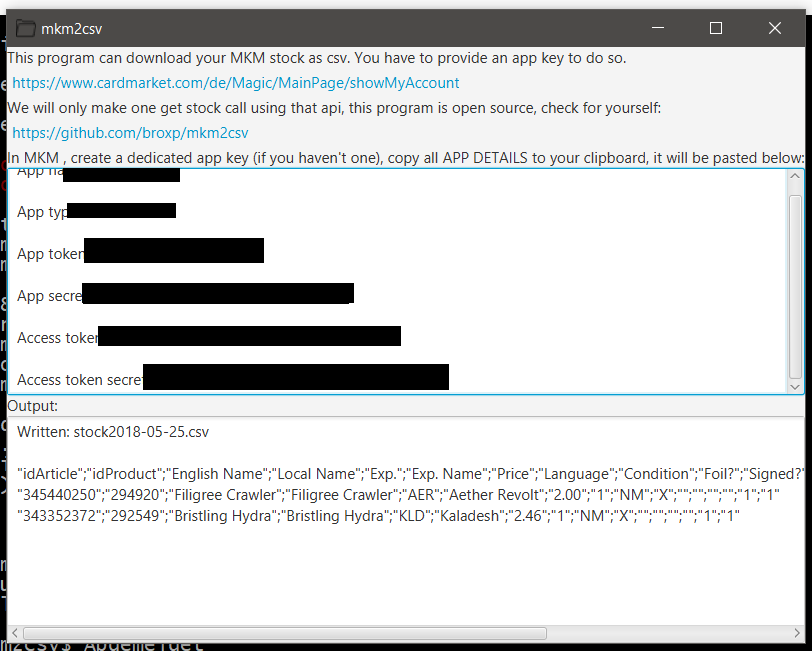

# mkm2csv

This small programm can place a api call to MKM to download your stock as CSV file.

The class that makes the call M11DedicatedApp is taken from the official MKM website: https://www.mkmapi.eu/ws/documentation/API:Auth_java

[Get the executable JAR file here](https://github.com/broxp/mkm2csv/raw/master/desktop/target/mkm2csv-1.0-SNAPSHOT-jar-with-dependencies.jar)

